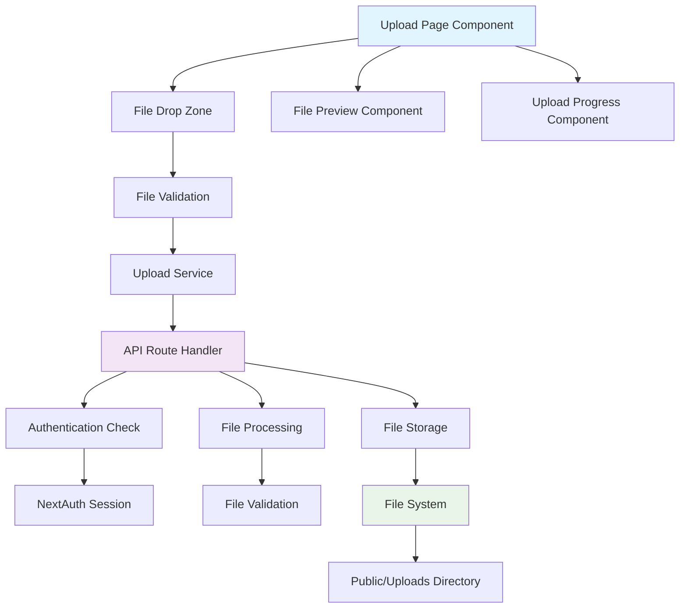

# Design Document

## Overview

The image upload page feature consists of a modern, responsive React component built with Next.js 15 and TypeScript that provides drag-and-drop file upload functionality. The system includes both frontend and backend components: a user-friendly upload interface with real-time feedback and a secure API endpoint that handles file validation, storage, and processing. The design leverages Next.js App Router architecture, Tailwind CSS for styling, and implements proper authentication using NextAuth.js.

## Architecture

### System Architecture



### Component Hierarchy

```
src/app/upload/
├── page.tsx (Upload Page)
├── components/
│   ├── FileDropZone.tsx
│   ├── FilePreview.tsx
│   ├── UploadProgress.tsx
│   └── UploadButton.tsx
├── hooks/
│   └── useFileUpload.ts
└── utils/
    └── fileValidation.ts

src/app/api/upload/
└── route.ts (API Handler)

src/types/
└── image.ts (Type Definitions)

src/lib/auth/
└── nextauth.config.ts (Auth Configuration)
```

## Components and Interfaces

### Core Components

#### 1. Upload Page Component (`src/app/upload/page.tsx`)

- Main container component that orchestrates the upload flow
- Handles authentication state and redirects
- Manages global upload state and error handling
- Responsive layout with mobile-first design

#### 2. FileDropZone Component (`src/app/upload/components/FileDropZone.tsx`)

- Drag-and-drop interface with visual feedback
- File selection through click or drag
- Real-time validation feedback
- Accessibility features (keyboard navigation, screen reader support)

#### 3. FilePreview Component (`src/app/upload/components/FilePreview.tsx`)

- Displays selected files with thumbnails
- Shows file metadata (name, size, type)
- Individual file removal functionality
- Featured image indicator

#### 4. UploadProgress Component (`src/app/upload/components/UploadProgress.tsx`)

- Real-time upload progress indicators
- Individual file progress tracking
- Error state visualization
- Success confirmation with uploaded image URLs

#### 5. Upload Service Hook (`src/app/upload/hooks/useFileUpload.ts`)

- Custom React hook for upload logic
- File validation and processing
- API communication
- State management for upload flow

### API Interface

#### Upload Endpoint (`/api/upload`)

- **Method**: POST
- **Content-Type**: multipart/form-data
- **Authentication**: Required (NextAuth session)
- **Request**: FormData with 'images' field containing File objects
- **Response**: Array of UploadedImage objects

```typescript
interface UploadedImage {
  url: string;
  filename: string;
  isFeatured: boolean;
}
```

### Authentication Integration

#### NextAuth Configuration

- Session-based authentication
- Middleware protection for upload routes
- Automatic session validation in API routes
- Graceful handling of expired sessions

## Data Models

### File Validation Schema

```typescript
interface FileValidationRules {
  allowedTypes: string[];
  maxSize: number;
  maxFiles: number;
}

interface ValidationResult {
  isValid: boolean;
  errors: string[];
}
```

### Upload State Management

```typescript
interface UploadState {
  files: File[];
  uploading: boolean;
  progress: Record<string, number>;
  errors: Record<string, string>;
  uploadedImages: UploadedImage[];
}
```

### Component Props Interfaces

```typescript
interface FileDropZoneProps {
  onFilesSelected: (files: File[]) => void;
  accept: string;
  maxFiles: number;
  disabled: boolean;
}

interface FilePreviewProps {
  files: File[];
  onRemoveFile: (index: number) => void;
  errors: Record<string, string>;
}

interface UploadProgressProps {
  progress: Record<string, number>;
  uploading: boolean;
  uploadedImages: UploadedImage[];
}
```

## Error Handling

### Client-Side Error Handling

1. **File Validation Errors**

   - Invalid file type notifications
   - File size limit warnings
   - Maximum file count restrictions

2. **Network Errors**

   - Connection timeout handling
   - Retry mechanism for failed uploads
   - Offline state detection

3. **Authentication Errors**
   - Session expiration handling
   - Automatic redirect to login
   - Token refresh attempts

### Server-Side Error Handling

1. **Authentication Failures**

   - 401 Unauthorized responses
   - Session validation errors
   - Proper error logging

2. **File Processing Errors**

   - File system permission issues
   - Directory creation failures
   - File write errors

3. **Validation Errors**
   - Detailed error messages for invalid files
   - Proper HTTP status codes
   - Security-focused error responses

## Testing Strategy

### Unit Testing

1. **Component Testing**

   - FileDropZone drag-and-drop functionality
   - FilePreview rendering and interactions
   - UploadProgress state updates
   - File validation utility functions

2. **Hook Testing**

   - useFileUpload state management
   - File processing logic
   - Error handling scenarios

3. **API Testing**
   - Authentication middleware
   - File upload processing
   - Error response handling
   - File system operations

### Integration Testing

1. **End-to-End Upload Flow**

   - Complete user journey from file selection to upload completion
   - Authentication integration
   - File storage verification

2. **Error Scenarios**
   - Network failure handling
   - Authentication expiration
   - File validation failures

### Performance Testing

1. **Large File Handling**

   - Multiple file upload performance
   - Memory usage optimization
   - Progress tracking accuracy

2. **Concurrent Upload Testing**
   - Multiple user upload scenarios
   - File system concurrency handling
   - API rate limiting

## Security Considerations

### File Security

- Strict file type validation using MIME types
- File size limitations to prevent DoS attacks
- Unique filename generation to prevent conflicts
- Secure file storage location

### Authentication Security

- Session-based authentication validation
- CSRF protection through NextAuth
- Proper error handling without information leakage
- Rate limiting considerations for upload endpoints

### Input Validation

- Server-side validation of all file properties
- Sanitization of file names
- Prevention of directory traversal attacks
- Validation of file content headers

## Performance Optimizations

### Frontend Optimizations

- Lazy loading of upload components
- Image thumbnail generation for previews
- Debounced file validation
- Optimistic UI updates

### Backend Optimizations

- Streaming file uploads for large files
- Efficient file system operations
- Proper error logging without performance impact
- Directory structure optimization for file access

### Caching Strategy

- Static asset caching for uploaded images
- Component-level caching for upload interface
- API response caching where appropriate
